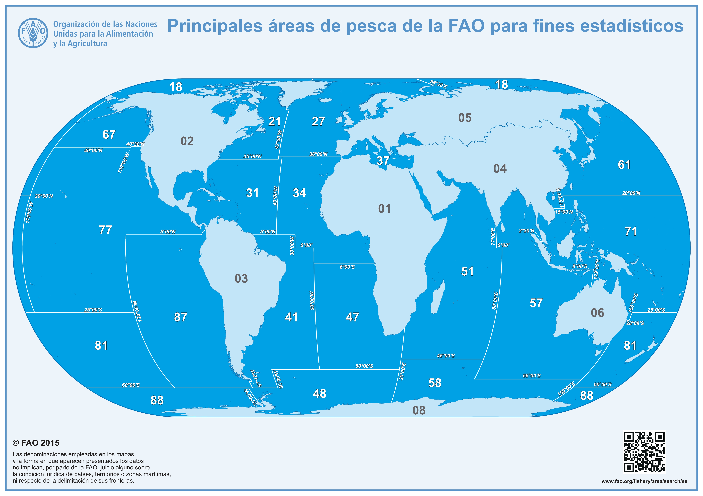

```{r setup, include=FALSE}
#Directorio de trabajo
setwd("D:/investigacion/Cursos/Curso R y Rmarkdown 2020/R-Rmarkdown-2020-Practica/Ejercicio-Curso-R-Rmarkdown-2020")
knitr::opts_chunk$set(echo = TRUE, warning = FALSE, message=FALSE)
library(tidyverse)
library(stargazer)
library(bookdown)
library(utf8)
library(tseries)
library(ggplot2)
library(scales)
library(ggthemes)
```

# Presentación del trabajo

El objetivo de este trabajo es realizar un informe y análisis reproducible con R y Rmarkdown. Para ello, se aplicarán los conocimientos adquiridos durante la realización del curso: 'Informes y análisis reproducibles con R y Rmarkdown' celebrado durante los días 10, 11, 17 y 18 de diciembre de 2020 organizado por el Centro de Estudios Andaluces (Junta de Andalucía) e impartido por el Doctor David García Callejas.

Para la realización del presente ejercicio se utiliza la base de datos de capturas marinas reconstruidas
de Sea Around Us [@zeller2016still], disponible en [**Sea Around US**[^1]](http://www.seaaroundus.org/). Esta base de datos está compuesta por registros de capturas globales marinas de 1146 especies piscícolas sometidas a explotación con una cobertura temporal de 1950 a 2018. 

Los registros de capturas son presentados para un determinado taxón/especie en un año específico, procedente de 6 áreas geolocalizadas: zona exclusiva económica, grandes ecosistemas marinos, ecorregiones marinas, organizaciones regionales de gestión pesquera, áreas globales y FAOs [^2]. Cada una de estas áreas está agrupada por:

1-Sector pesquero (industrial, artesanal de subsistencia y recreativo). 

2-Países. 

3-Tipos de artes de pesca. 

Los datos reconstruidos resultan de la combinación entre los datos oficiales comunicados y estimaciones de datos no comunicados (principalmente descartes) o no declarados. Las estimaciones de los datos no comunicados se realizan para los cuatro sectores de pesca. Los datos oficiales se extraen de las bases de datos FishStat de la [**FAO**](http://www.fao.org/fishery/statistics/en). 

Así, a partir de esta base de datos filtrada por el área FAO 34 se pretende construir y analizar la evolución temporal de las capturas reconstruidas de 1950 a 2018, además de estudiar la tendencia lineal mediante la aplicación de métodos de regresión. La variable de estudio es *"tonnes"* que representa las capturas reconstruidas totales en toneladas, obtenidas como la suma de los desembarcos más los descartes procedentes de los diferentes estados del reporte, sectores pesqueros, artes de pesca y uso final. Los datos concretos del área FAO 34 pueden ser descargados en  [**FAO 34**](http://www.seaaroundus.org/data/#/fao/34).


[^1]: Las palabras en negrita significan que están vinculadas a un enlace web. 
[^2]: FAO = Organización de las Naciones Unidas para la Agricultura y la Alimentación.

# Área de estudio
## FAO 34 o Atlántico Centro Oriental

El área FAO 34 se localiza en el atlántico centro oriental (36º N, 30-40º W, 6º S) frente a la costa occidental de África, abarcando desde el Estrecho de Gibraltar hasta la desembocadura del río Zaire (frontera entre República Democrática del Congo y Congo). Cuenta con una extensión de 14,074,956 km^2^, se subdividide en 4 subáreas y la FAO la cataloga como área de afloramiento.

```{r fig1, fig.align='center',fig.cap='Localización del área FAO 34.',out.width="80%"}



```

# Lectura de datos y generación de la serie temporal

En este apartado se procede a la carga de los datos, su lectura y preparación del conjunto de datos para la aplicación del método de regresión. 

```{r data, echo=TRUE}

#Lectura de datos
FAO34 <-read.csv("SAU FAO 34 v48-0.csv", header = T)

#Dimensión del conjunto de datos: 638156 observaciones y 14 variables
dim(FAO34)

#Resumen estadístico de nuesta variable de estudio: tonnes (toneladas)
summary(FAO34$tonnes)

#Definimos a la variable year como factor
FAO34$fYear <- factor(FAO34$year)

#Creamos un nuevo data frame con la serie anual global calculada
FAO34_Anual<-as.data.frame(aggregate(tonnes ~ fYear, 
                                     data = FAO34, FUN = sum))

#Definimos la serie anterior como una serie temporal
FAOglobal34<-ts(FAO34_Anual$tonnes,start=1950,frequency=1)

#Obtenemos la variable temporal y la incorporamos a nuestro 
#conjunto de datos FAO34_Anual
FAO34_Anual$time<- time(FAOglobal34)

```

# Representación de la serie temporal

Una vez generada nuestra serie temporal procedemos a representarla. Para ello, empleamos el siguiente código:

```{r fig2, fig.align='center',fig.cap='Evolución histórica de las capturas reconstruidas del área FAO 34.\\label{serie1} ',out.width="70%"}
ggplot()+
  geom_line(data = FAO34_Anual, 
                   aes(y = (tonnes)/1000, x = time),
                   linetype="solid", 
                   size = 0.5)+
  theme_classic()+
  labs(x="Años",y="Capturas (toneladas x 1000)")+
  ggtitle("Capturas reconstruidas para el área FAO 34 (1950-2018)")+
  theme (plot.title = element_text(family="serif",
                                   size=rel(1.4), 
                                   vjust=0.5, 
                                   hjust=0.5,
                                   face="bold", 
                                   color="black", 
                                   lineheight=1.5))+
  scale_y_continuous(breaks=seq(0, 16000, 2000),limits =c(0,16000))+
  scale_x_continuous(breaks=c(1950,1960,1970,1980,1990,2000,2010,2020),
                     labels=c("1950","1960","1970","1980","1990",
                              "2000","2010","2020"))+
  theme(axis.text.x = element_text( vjust=-0.5, colour="black", 
                                    size=rel(1.4), family="serif"))+
  theme(axis.text.y = element_text( vjust=0.4, colour="black", 
                                    size=rel(1.4), family="serif"))+
  theme(axis.line.x=element_line(color="black", size=0.5))+
  theme(axis.line.y=element_line(color="black", size=0.5))+
  theme(axis.title.x = element_text( vjust=-0.5, colour="black", 
                                     size=rel(1.4),family = "serif"))+
  theme(axis.title.y = element_text( vjust=1.5, colour="black", 
                                     size=rel(1.4),family="serif"))+
  NULL

```

En la figura **\ref{serie1}**, se observa como las capturas aumentan desde 1950 hasta la década de los años 80, donde a partir de ahí se estabilizan oscilando entre [12000-16000] x 1000 toneladas hasta el año 2018. Se aprecia claramente cómo las capturas aumentan desde su inicio en 1950 con 1756.046 x 1000 toneladas hasta su final con 13581.17 x 1000 toneladas, lo que supone un incremento de 673.39 % del año 2018 respecto del año 1950.


```{r porcentaje, echo=TRUE}
#Cálculo del porcentaje de variación de las capturas 
#del año 2018 respecto del año 1950

#Seleccionamos el dato de toneladas del año 2018

Capturas_2018 = subset (FAO34_Anual, time=="2018")
Capturas_2018 = Capturas_2018[,-c(1,3)]

#Seleccionamos el dato de toneladas del año 1950

Capturas_1950 = subset (FAO34_Anual, time=="1950")
Capturas_1950 = Capturas_1950[,-c(1,3)]

#Calculamos el porcentaje como: 

((Capturas_2018-Capturas_1950)/Capturas_1950)*100

```

# Aplicación del método de regresión

Se utiliza un método estadístico clásico de análisis de regresión para estimar los parámetros de los modelos comunes de tendencia. Para ello, emplearemos tendencias lineales y cuadráticas temporales.

## Tendencia lineal temporal

En este apartado se calcula una tendencia determinista lineal (orden 1) temporal, estimando la pendiente y el intercepto mediante la regresión de mínimos cuadrados. La tendencia temporal lineal es expresada como: 

\begin{equation}
\mu_0 = \beta_0 + \beta_1 * t \label{eq:eq1}
\end{equation}

donde $\mu_0$ es la tendencia temporal determinista, $\beta_0$ es el intercepto, $\beta_1$ es la pendiente y *t* es el tiempo (años en nuestro caso). De tal manera que la aplicación de la ecuación \@ref(eq:eq1) a nuestros datos quedaría:

\begin{equation}
toneladas_0 = \beta_0 + \beta_1 * años \label{eq:eq2}
\end{equation}

Donde *"toneladas~0~"* hace referencia a la tendencia de las toneladas. 

### Aplicación del modelo

A continuación, aplicamos la ecuación \@ref(eq:eq2) a nuestros datos:

```{r modelo1, echo=TRUE}
#Aplicación del modelo
tendencia_lineal <- lm(tonnes ~ I(time), data =FAO34_Anual)

```

```{r table1, results='asis'}
#Tabla resumen estadístico del modelo
stargazer::stargazer(tendencia_lineal,label="tabla1", 
                     header=FALSE, 
                     title = "Parámetros, errores estándares, 
                     valores-z y p-valores estimados por la ecuación (2).")

```

### Interpretación del modelo

A partir del cuadro \@ref(tabla1), observamos que el sobre 71 % de la variación en la serie temporal de las capturas es explicada por la tendencia temporal lineal, siendo todos los parámetros de la tendencia claramente significativos. El signo de la tendencia es positivo tal y como indica la pendiente. Por tanto, siguiendo la ecuación \@ref(eq:eq2) y los resultados del cuadro \@ref(tabla1) el modelo quedaría como:

\begin{equation}
toneladas_0 = -396521,639 * (1000) + 205,365 * (1000) * años \label{eq:eq3}
\end{equation}

### Análisis de los residuos

Una vez interpretado nuestro modelo, pasamos a validarlo mediante el análisis de sus residuos ordinarios calculados como:

\begin{equation}
residuo_i = y_i - \hat{y_i} \label{eq:eq4}
\end{equation}

donde $residuo_i$ es el residuo ordinario para un año i, $y_i$ es el valor observado de la captura en el año i y $\hat{y_i}$ es el valor predicho de la captura por la ecuación \@ref(eq:eq3) para un año i. Si el modelo generado es correcto, los residuos generados deben ser un ruido blanco, es decir, que no tengan ninguna estructura de dependencia significativa, además deber ser normales, homogéneos y carecer de valores influyentes en los valores ajustados del modelo. Todo este análisis se realiza mediante gráficos.

```{r residuos1, echo=TRUE}
#Extracción de los valores ajustados por el modelo de la ecuación 3
F1 <- fitted(tendencia_lineal)
#Extracción de los residuos
E1 <- resid(tendencia_lineal)

```

```{r fig3, fig.align='center',fig.cap='Estudio de la homogeneidad.\\label{homogeneidad1}',out.width="45%",fig.show='hold'}
par(mar = c(4, 4, 2, 2))
plot(x = F1, y = E1, 
     type="p",
     xlab = "Valores ajustados de la tendencia",
     ylab = "Residuos", 
     main = "¿Homogeneidad?")
abline(h = 0, v = 0, lty = 2)
plot(x = as.vector(FAO34_Anual$time), y = E1,
     type="l",
     xlab = "Años",
     ylab = "Residuos", 
     main = "¿Homogeneidad?")
abline(h = 0, v = 0, lty = 2)

```

Para estudiar la homogeneidad se representan los residuos vs los valores ajustados (**izquierda**) y los residuos vs el tiempo (**derecha**) (Fig. **\ref{homogeneidad1}**). Una serie es homocedástica cuando su variabilidad  es constante a lo largo del tiempo. La variabilidad se refiere al “grosor” de la serie, es decir, si los residuos fuesen homogéneos deberíamos observar la misma extensión por cualquier lado. En la figura 3 podemos observar como la variabilidad o el grosor de la serie se mantiene constante a lo largo del tiempo, lo que estaría indicando que los residuos son homocedásticos. 

Para estudiar la normalidad se realiza el histograma de los residuos (**izquierda**) y su correspondiente gráfico Q-Q (**derecha**) (Fig. **\ref{normalidad1}**). En la figura 4 podemos observar que existe una dispersión de los residuos por la colas con un amplio rango de frencuencia, indicando que los residuos no son normales. Este aspecto es discutible en los métodos de regresión, aunque es importante, no es aspecto crucial en la validación del modelo. 

```{r fig4, fig.align='center',fig.cap='Estudio de la normalidad.\\label{normalidad1}',out.width="45%",fig.show='hold'}
par(mar = c(4, 4, 2, 2))
hist(E1, main = "Normalidad", breaks=10)
qqnorm(E1)
qqline(E1)

```

Para el estudio de la independencia de los residuos, se representan los residuos vs el tiempo (**izquierda**) y su función de autocorrelación (ACF) (**derecha**) (Fig. **\ref{independencia1}**), que mide la correlacción existente entre los datos de la serie temporal separados por *k* desfases o *lags*, indicando, si los valores pasados influyen sobre los presentes, de tal modo que, si las observaciones fuesen independientes no habría correlación significativa.  En la figura **\ref{independencia1}**, observamos como existe un patrón no lineal de los residuos, además de bloques importantes de correlacciones significativas (palos fuera de las bandas de confianza). Si los residuos fuesen independientes no se tendrían que observar patrones ni correlacciones significativas. 

```{r fig5, fig.align='center',fig.cap='Estudio de la independencia. \\label{independencia1}',out.width="45%",fig.show='hold'}
par(mar = c(4, 4, 3, 3))
plot(x = as.vector(FAO34_Anual$time), y = E1,
     type="l",
     xlab = "Años",
     ylab = "Residuos", 
     main = "¿Independencia?")
abline(h = 0, v = 0, lty = 2)
acf(E1,lag.max=42, main = "¿Independencia?")
```

Finalmente, las observaciones influyentes se estudian mediante la aplicación de la distancia de Cook. En la figura **\ref{influyentes1}**, no aparecen observaciones influyentes en los valores ajustados por el modelo.  

```{r fig6, fig.align='center',fig.cap='Estudio de los valores influyentes. \\label{influyentes1}',out.width="45%",fig.show='hold'}
plot(cooks.distance(tendencia_lineal), type = "h", ylim = c(0, 1))
abline(h = 1, col = 2,lwd = 3)
```

### Conclusiones de la tendencia lineal temporal

Tras la aplicación del método de regresión, se ha visto como el 71% de la variación en la serie temporal de las capturas es explicada por una tendencia temporal lineal negativa significativa, siendo además todos los parámetros del modelo significativos. El análisis de los residuos indicó que estos no seguían un estructura de ruido blanco y no eran normales, pero sí homocedásticos y el modelo no tuvo valores ajustados con observaciones influyentes. El hecho de encontrar patrones en los residuos, causantes de la no independencia, podría estar indicando la necesidad de incluir al modelo un nuevo término que sea capaz de reducir estos patrones. Por este motivo se realiza de nuevo todo el análisis anterior incorporando al modelo de la ecuación \@ref(eq:eq1) un término cuadrático, ajustando una tendencia cuadrática temporal. 

## Tendencia cuadrática temporal

En este apartado se calcula una tendencia determinista cuadrática (orden 2) temporal a partir de la siguiente ecuación:

\begin{equation}
\mu_0 = \beta_0 + \beta_1 * t + \beta_2 * t^2 \label{eq:eq5}
\end{equation}

donde $\mu_0$ es la tendencia temporal determinista, $\beta_0$ es el intercepto, $\beta_1$ es la pendiente de orden 1,  $\beta_2$ es la pendiente de orden 2 y *t* es el tiempo (años en nuestro caso). De tal manera que la aplicación de la ecuación \@ref(eq:eq5) a nuestros datos quedaría:

\begin{equation}
toneladas_0 = \beta_0 + \beta_1 * años + \beta_2 * años^2  \label{eq:eq6}
\end{equation}

Donde *"toneladas~0~"* hace referencia a la tendencia de las toneladas.

### Aplicación del modelo

Aplicamos la ecuación \@ref(eq:eq6) a nuestros datos:

```{r modelo2, echo=TRUE}
#Aplicación del modelo
tendencia_cuadratica <- lm(tonnes ~ I(time) + I(time^2), data =FAO34_Anual)

```

```{r table2, results='asis'}
#Tabla resumen estadístico del modelo
stargazer::stargazer(tendencia_cuadratica,label="tabla2", 
                     header=FALSE, 
                     title = "Parámetros, errores estándares, 
                     valores-z y p-valores estimados por la ecuación (6).")

```

### Interpretación del modelo

A partir del cuadro \@ref(tabla2), apreciamos que el porcentaje de variación explicado por la tendencia temporal cuadrática se ha incrementado un 23 %, pasando a ser del 93 %, en comparación con el modelo de tendencia temporal lineal. Al igual que ocurrió con el modelo anterior, todos los parámetros de este nuevo modelo son significativos. EL signo de la pendiente de orden 1 es positivo mientras que el de orden 2 es negativo. Siguiendo la ecuación \@ref(eq:eq6) y los resultados del cuadro \@ref(tabla2) el modelo quedaría como:

\begin{equation}
toneladas_0 = -25868408 * (1000) + 25885,26 * (1000) * años -6,471747 * (1000) * años^2  \label{eq:eq7}
\end{equation}

### Análisis de los residuos

Procedemos a realizar el mismo análisis de los residuos que hicimos con el modelo anterior.

```{r residuos2, echo=TRUE}
#Extracción de los valores ajustados por el modelo de la ecuación 7
F2 <- fitted(tendencia_cuadratica)
#Extracción de los residuos
E2 <- resid(tendencia_cuadratica)

```

En la figura **\ref{homogeneridad2}** se representan los residuos vs los valores ajustados (**izquierda**) y los residuos vs el tiempo (**derecha**). Observamos que existe un dispersión o aumento de grosor de la serie en su parte final, indicando que la homogeneidad no se cumpliría a lo largo de toda la serie.

```{r fig7, fig.align='center',fig.cap='Estudio de la homogeneidad. \\label{homogeneridad2}',out.width="45%",fig.show='hold'}
par(mar = c(4, 4, 2, 2))
plot(x = F2, y = E2, 
     type="p",
     xlab = "Valores ajustados de la tendencia",
     ylab = "Residuos", 
     main = "¿Homogeneidad?")
abline(h = 0, v = 0, lty = 2)
plot(x = as.vector(FAO34_Anual$time), y = E2,
     type="l",
     xlab = "Años",
     ylab = "Residuos", 
     main = "¿Homogeneidad?")
abline(h = 0, v = 0, lty = 2)

```

Se realiza el histograma de los residuos (**izquierda**) y su correspondiente gráfico Q-Q (**derecha**) (Fig. **\ref{normalidad2}**). Apreciamos cómo los residuos son normales. 

```{r fig8, fig.align='center',fig.cap='Estudio de la normalidad. \\label{normalidad2}',out.width="45%",fig.show='hold'}
par(mar = c(4, 4, 2, 2))
hist(E2, main = "Normalidad", breaks=10)
qqnorm(E2)
qqline(E2)

```

Para la independencia de los residuos, se representan los residuos vs el tiempo (**izquierda**) y su función de autocorrelación (ACF) (**derecha**) (Fig. **\ref{independencia2}**). Observamos cómo siguen existiendo patrones en los residuos, además de bloques importantes de correlacciones significativas (palos fuera de las bandas de confianza). Aunque en comparación con el modelo anterior, podemos ver cómo la incorporación del término cuadrático ha reducido la intensidad de estos patrones, llegando a aparecer bloques temporales en torno al cero sin correlacciones significativas, indicando que aproximadamente a partir de desfases de 20 años, no existe influencia significativa de los valores pasados sobre los presentes. 

```{r fig9, fig.align='center',fig.cap='Estudio de la independencia. \\label{independencia2}',out.width="45%",fig.show='hold'}
par(mar = c(4, 4, 3, 3))
plot(x = as.vector(FAO34_Anual$time), y = E2,
     type="l",
     xlab = "Años",
     ylab = "Residuos", 
     main = "¿Independencia?")
abline(h = 0, v = 0, lty = 2)
acf(E2,lag.max=42, main = "¿Independencia?")
```

Por último, en la figura **\ref{influyentes2}** no aparecen observaciones influyentes.

```{r fig10, fig.align='center',fig.cap='Estudio de los valores influyentes. \\label{influyentes2}',out.width="45%",fig.show='hold'}
plot(cooks.distance(tendencia_cuadratica), type = "h", ylim = c(0, 1))
abline(h = 1, col = 2,lwd = 3)
```

### Conclusiones de la tendencia cuadrática temporal

Tras la realización de este nuevo modelo, hemos visto como el porcentaje de la variación explicada por la tendencia de las capturas ha aumentado hasta un 93%. La tendencia cuadrática fue significativa, presentando distintos signos en función del orden temporal, siendo positiva para un orden 1 y negativa para un orden 2. Todos los parámetros del modelo fueron significativos. La incorporación del término cuadrático produjo una amortiguación de los patrones de los residuos, ocasionando que estos presentasen bloques similares a un ruido y además hizo que los residuos fuesen normales, pero aumentó su dispersión. Igual que en el caso de la tendencia lineal temporal, el modelo cuadrático no tuvo valores ajustados con obervaciones influyentes.

# Representación visual de los modelos presentados

El objetivo de este apartado es visualizar el comportamiento de los modelos ajustados para ello seguimos los siguientes pasos:

1- Creamos una serie de valores de años, digamos por ejemplo 25 años.

2- Predecimos los valores de la tendencia para esos 25 valores.

3- Calculamos los intervalos de confianza al 95 %.

4- Dibujamos los valores de años predichos de tendencia frente a la serie original.

## Tendencia lineal temporal

Para realizar los pasos anteriores utilizaremos la ecuación \@ref(eq:eq3).

```{r cuadratica, echo=TRUE}
#Paso 1
MyTL <- data.frame(time = seq(from = 1950,
                                to = 2018,
                                length = 25))
#Paso 2
TL <- predict(tendencia_lineal, newdata = MyTL, se = TRUE, type = "response")

#Paso 3
MyTL$Pred <- TL$fit                    #Valor predicho
MyTL$seup <- TL$fit + 1.96 * TL$se.fit #Valor superior del intervalo de confianza al 95%
MyTL$selo <- TL$fit - 1.96 * TL$se.fit #Valor inferior del intervalo de confianza al 95%
```

## Tendencia cuadrática temporal
 
Para realizar los pasos anteriores utilizaremos la ecuación \@ref(eq:eq7).

```{r lineal, echo=TRUE}
#Paso 1
MyTC <- data.frame(time = seq(from = 1950,
                                to = 2018,
                                length = 25))
#Paso 2
TC <- predict(tendencia_cuadratica, newdata = MyTC, se = TRUE, type = "response")

#Paso 3
MyTC$Pred <- TC$fit                    #Valor predicho
MyTC$seup <- TC$fit + 1.96 * TC$se.fit #Valor superior del intervalo de confianza al 95%
MyTC$selo <- TC$fit - 1.96 * TC$se.fit #Valor inferior del intervalo de confianza al 95%
```

```{r fig11, fig.align='center',fig.cap='Ajuste del modelo lineal a partir de la ecuación 3 (izquierda) y del modelo cuadrático a partir de la ecuación 7 (derecha). \\label{visual1}',out.width="45%",fig.show='hold'}
#Representación visual de los modelos
par(mar = c(4, 4, 3, 3))
#Modelo lineal
ggplot()+
geom_line(data = FAO34_Anual, 
                   aes(y = (tonnes)/1000, x = time),
                   linetype="solid", 
                   size = 0.5)+
theme_classic()+
labs(x="Años",y="Capturas (toneladas x 1000)")+
scale_y_continuous(breaks=seq(0, 20000, 5000),limits =c(0,20000))+
scale_x_continuous(breaks=c(1950,1960,1970,1980,1990,2000,2010,2020),
                   labels=c("1950","1960","1970","1980","1990","2000","2010","2020"))+
theme(text = element_text(size=15))+
theme(legend.position="")+
geom_line(data = MyTL, 
                   aes(x = time, y = (Pred)/1000), 
                   colour = "red")+
geom_ribbon(data = MyTL, 
                     aes(x = time, 
                         ymax = (seup)/1000, 
                         ymin = (selo)/1000,
                     alpha = 0.5))+
  theme(axis.text.x = element_text( vjust=-0.5, colour="black", 
                                    size=rel(1.2), family="serif"))+
  theme(axis.text.y = element_text( vjust=0.4, colour="black", 
                                    size=rel(1.2), family="serif"))+
  theme(axis.line.x=element_line(color="black", size=0.5))+
  theme(axis.line.y=element_line(color="black", size=0.5))+
  theme(axis.title.x = element_text( vjust=-0.5, colour="black", 
                                     size=rel(1.2),family = "serif"))+
  theme(axis.title.y = element_text( vjust=1.5, colour="black", 
                                     size=rel(1.2),family="serif"))+
NULL

#Modelo cuadrático
ggplot()+
geom_line(data = FAO34_Anual, 
                   aes(y = (tonnes)/1000, x = time),
                   linetype="solid", 
                   size = 0.5)+
theme_classic()+
labs(x="Años",y="Capturas (toneladas x 1000)")+
scale_y_continuous(breaks=seq(0, 20000, 5000),limits =c(0,20000))+
scale_x_continuous(breaks=c(1950,1960,1970,1980,1990,2000,2010,2020),
                   labels=c("1950","1960","1970","1980","1990","2000","2010","2020"))+
theme(text = element_text(size=15))+
theme(legend.position="")+
geom_line(data = MyTC, 
                   aes(x = time, y = (Pred)/1000), 
                   colour = "red")+
geom_ribbon(data = MyTC, 
                     aes(x = time, 
                         ymax = (seup)/1000, 
                         ymin = (selo)/1000,
                     alpha = 0.5))+
  theme(axis.text.x = element_text( vjust=-0.5, colour="black", 
                                    size=rel(1.2), family="serif"))+
  theme(axis.text.y = element_text( vjust=0.4, colour="black", 
                                    size=rel(1.2), family="serif"))+
  theme(axis.line.x=element_line(color="black", size=0.5))+
  theme(axis.line.y=element_line(color="black", size=0.5))+
  theme(axis.title.x = element_text( vjust=-0.5, colour="black", 
                                     size=rel(1.2),family = "serif"))+
  theme(axis.title.y = element_text( vjust=1.5, colour="black", 
                                     size=rel(1.2),family="serif"))+
  NULL

```

# Conclusiones

En la figura **\ref{visual1}** podemos observar el ajustes de los modelos, en principio apreciamos como el modelo cuadrático se ajusta mejor a la forma de la serie de las capturas. Por tanto según nuestros análisis, el modelo seleccionado para el estudio de la tendencia de las capturas reconstruidas desde 1950 a 2018 para el área FAO 34 podría ser el modelo cuadrático, ya que presentó mayor coeficiente de determinación y mejores resultados estadísticos del análisis de los residuos y visuales, indicando que la tendencia de las capturas se ajusta mejor a una tendencia de tipo no lineal. Los residuos del modelo seleccionado presentan todavía patrones y una ligera dispersión, ocasionando que su interpretación sea tomada con cautela, pero todos sus términos son muy significativos y razonablemente robustos. Ante esta situación, para eliminar estos patrones, otras técnicas estadísticas podrían ser planteadas como: modelos generalizados (GLM), modelos generalizados mixtos (GLMM), modelos aditivos generalizados (GAM), modelos aditivos generalizados mixtos (GAMM), modelos generalizados de mínimos cuadrados (GLS) y modelos  autorregresivos integrados de medias móviles (ARIMA), entre otras. De todas maneras, los modelos presentados en este trabajo, podría ser utilizados como una primera aproximación para detectar el patrón general de la serie y ayudar a comprender su comportamiento, siendo conscientes de la limitación de los mismos y el propósito de su utilización. En este estudio, el modelo seleccionado se utilizó para comprender y visualizar el patrón general y la tendencia de la serie. 

# Referencias
<div id = "refs"></div>

